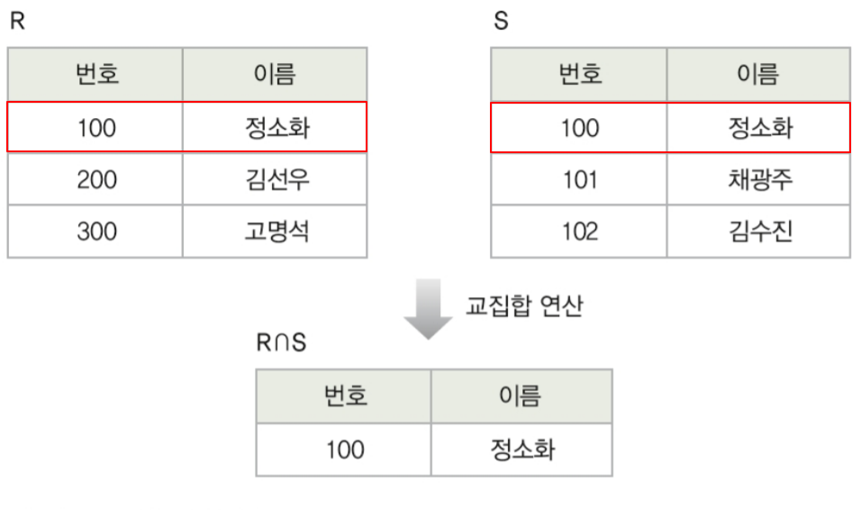
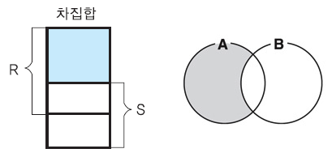
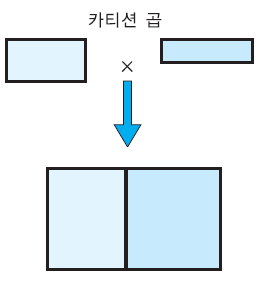
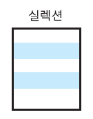
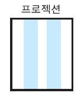
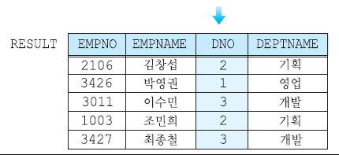
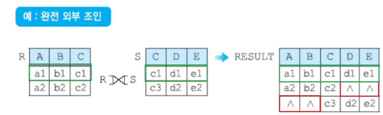
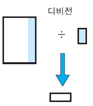
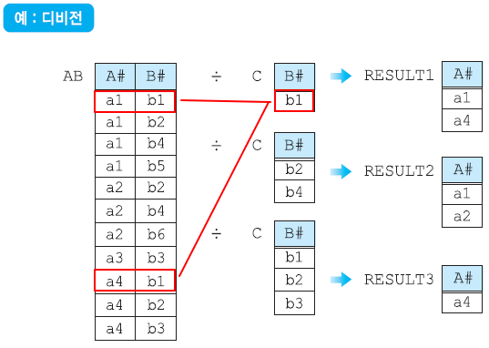

# 관계대수의 8대 연산자
:::tip
- 일반집합 연산자: 합집합 / 교집합 / 차집합 / 카티션곱
- 순수관계 연산자: 셀렉션 / 프로젝션 / 조인 / 디비전
:::

## 🐣 일반집합 연산자
---

### 🥚 합집합 : 중복제거 테이블 합

- 중복을 제외하고 두 릴레이션의 튜플들을 합침
- ∪ 로 연산자를 표현
- 합집합은 '합집합 호환 조건' 이 맞아야만 실행할 수 있음.
  - 갯수가 다르거나 도메인이 다르면 안된다

### 🥚 교집합 : 겹치는 것만 테이블

- 두 릴레이션의 튜플들의 겹치는 부분만을 도출
- ∩로 연산자를 표현

 

### 🥚 차집합 : A - B 한 결과 테이블
- 두 릴레이션의 튜플들의 겹치지 않는 부분만을 도출 
- -로 연산자를 표현

  

### 🥚 카티션 곱 : 가능한 모든 조합 경우의 수

- 두 릴레이션(테이블) 에서 가능한 모든 조합을 만들어주는 연산자
- 두 테이블로 만들 수 있는 모든 경우의 수를 나타내는 전체 집합을 도출
- 카디션 곱해서 나오는게 값이 크면 오버헤드가 너무 커지기 때문에 실제로는 카티션 곱 연산자는 사용하지않고 뒤에서 배울 조인(join) 연산자를 사용한다.
- ×로 연산자를 표현

## 🐣 순수관계 연산자
---

### 🥚 셀렉션 : 테이블에서 원하는 데이터 조회

• 원하는 데이터를  `수평적`으로 도출함
• σ (sigma)로 연산자를 표현

### 🥚 프로젝션 : 테이블에서 특정 속성만 지정해 조회

- 원하는 데이터를  `수직적`으로 도출함
- • Π (pi)로 연산자를 표현
- 셀렉션과 달리 결과릴레이션에 중복된 튜플 존재가능성이 있으며, 이경우 중복 자동 제거

### 🥚 조인 : 결합

- 두 개의 릴레이션으로부터 연관된 투플들을 결합하는 연산자
- ⋈로 연산자를 표현
- 조인 연산자는 다음과 같이 연산 방식에 따라 여러 조인으로 나뉜다
    - 세타 조인(theta join)
    - 동등 조인(equi join)
    - 자연 조인(natural join)
    - 외부 조인(outer join)
    - 세미 조인(semi join)

#### 🥚 세타 조인 & 동등조인

- 세타 조인은 두 릴레이션에서 공통된 애트리뷰트를 기준으로 비교 연산자(=,\<\>,\<=,\<,\>=,\>)를 사용하여 조건을 만족하는 튜플들을 결합
- 동등 조인은 세타 조인 중에서 비교 연산자가 =인 조인이다. 즉, 두 릴레이션에서 공통된 애트리뷰트의 값이 같은 튜플들을 결합

##### 🥚 자연조인
- 동등 조인의 결과 릴레이션에서 조인 애트리뷰트를 제외한 조인 (중복 필드 제거)

#### 🥚 외부조인

- 널값이 들어 있는 투플들을 다루기 위해서 조인 연산을 확장한 조인
- 일반적인 조인은 두 릴레이션에서 대응되는 튜플이 없을 경우, 그 튜플을 결과에 포함시키지 않는다. 하지만 외부 조인은 대응되는 튜플이 없어도 결과에 포함시키고, 상대 릴레이션의 애트리뷰트 값은 null로 채운다.
- 외부 조인에는 어느 릴레이션을 기준으로 null로 채우는지에 따라 3가지로 나뉜다.
    - 왼쪽 외부 조인(left outer join)
    - 오른쪽 외부 조인(right outer join)
    - 완전 외부 조인(full outer join)

###### left outer join

###### right outer join

###### full outer join

### 🥚 디비전 : 분할

- 한 테이블에서 다른 테이블의 모든 값을 가지고 있는 행들을 찾아주는 연산자
- ÷로 연산자를 표현
- '모든 ~에 대해 ~하는' 형태의 질의에 사용될 수 있음
- 디비전은 나누는 테이블의 열의 개수만큼 결과 테이블의 열의 개수가 줄어들게 된다

   

