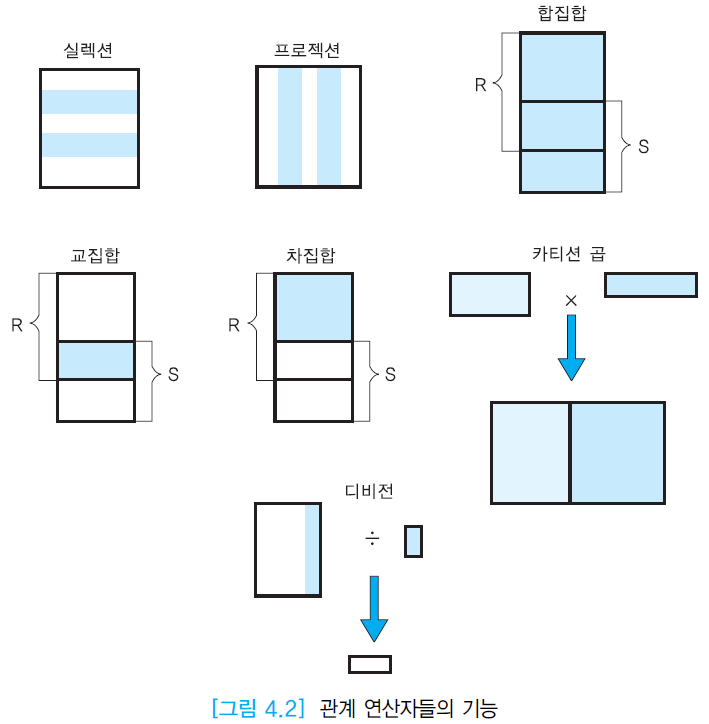

# 관계대수

## 🐣 관계대수란 무엇인가요?

:::tip

릴레이션을 순차적으로 연산해 원하는 릴레이션을 생성하는 `절차적` 언어

- 일반집합 연산자: 합집합(∪) / 교집합(∩) / 차집합(-) / 카티션프로덕트(×)
- 순수관계 연산자: SELECT / PROJECT / JOIN / DIVISION

:::
####### *릴레이션: 테이블과 같은 의미

### 🥚 관계데이터 연산

- 숫자를 연산해 원하는 수를 구하듯, 릴레이션을 연산해 원하는 릴레이션을 도출
    - 관계대수
    - 관계해석

### 🥚 관계해석

- 원하는 데이터만 명시하고 질의를 어떻게 수행할 것인가는 명시하지 않음(What)
- 비절차적 언어
- 튜플관계해석과 도메인관계해석이 있음

### 🥚 관계대수

- [연산자들](./RelatAlgeOperator.md) 의 집합
    - 일반집합 연산자 (Set Operation)
    - 순수관계 연산자 (Relational Operation)
- [SQL](../SQL.md)의 이론적 기초 (링크)

### 🥚 관계적으로 완전하다 (Relationally Complete)

- 특정 데이터언어에 대해 관계데이터 연산으로 기술할 수 있는 모든 질의(Qurery)를 기술할 수 있으면 → 관계적으로 완전하다
- 데이터언어 검증기준중 하나

### 🥚 관계대수 한계

- 산술연산 불가
- 집단함수 (SUM, AVG, COCUNT, MAX, MIN) 지원하지 않음
- 데이터베이스 수정 불가
- 프로젝션 연산 결과로 중복된 튜플 표현 불가
- 연산의 결과 정렬불가