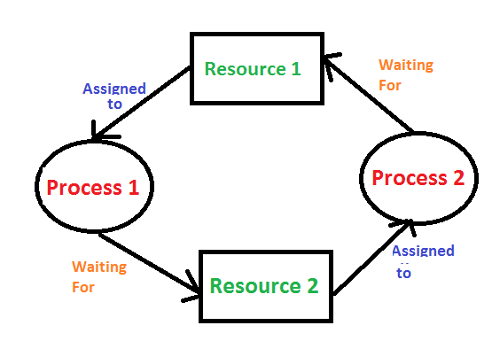

# 락으로 발생하는 문제

## 🐣 락으로 발생하는 문제

:::tip

- 블로킹 (Blokcing)
- 교착상태 (DeadLock)

:::

## 🐣 블로킹 (Blocking)??

### 🥚 블로킹 (Blocking)??

:::tip

`베타락-베타락`, `베타락-공유락` (베타락과 다른락)간의 경합이 발생하여 특정 Transaction이 작업을 진행하지 못하고 멈춰선 상태
- 베타락은 블로킹을 발생시킴 (공유락은 발생시키지 않음)

:::

### 🥚 블로킹 해소방안

- 이전의 트랜잭션이 완료(커밋 OR 롤백)하기
    - 새 트랜잭션은 이전 트랜잭션이 마무리되어야 진행 가능
    - 블로킹을 최소화해야 성능이 좋아짐

### 🥚 블로킹 예방방안

1. 한 트랜잭션의 길이를 너무 길게하지 않기
2. 처음부터 설계할 때 같은 데이터를 갱신하는 트랜잭션이 동시에 수행되지 않도록 하기
3. 트랜잭션 격리성 수준을 불필요하게 상향 조정하지 않기
4. 쿼리를 오랜시간 잡아두지 않도록 적절한 튜닝
5. DBMS에 따라서 lock 대기 시간 등을 설정

.

## 🐣 교착상태 (DeadLock)??

:::tip

`식사하는 철학자`

- 각 프로세스가 할당된 자원에 Lock을 걸고 서로의 Lock이 걸린 자원에 접근하여, 모든 프로세스가 Request 상태가 되어 영원히 처리가 되지 않는 상태

:::

##### 프로세스가 자원을 사용하는 절차

1. **Request** :  자원을 요청하고, 만약 다른 프로세스가 자원을 사용하고 있어 받을 수 없다면 대기한다.
2. **Allocate** : 자원을 받는다.
3. **Use** : 프로세스가 받은 자원을 사용한다.
4. **Release** : 프로세스가 자원을 놓아준다.

##### 자원할당 그래프

- R은 자원이고 P는 프로세스, 자원 내의 동그라미는 자원(인스턴스)의 개수
- **자원 → 프로세스**로 향하는 간선은 해당 자원을 프로세스가 보유 중(Allocate)
- **프로세스 → 자원**으로 향하는 간선은 프로세스가 해당 자원을 요청(Request)
- 그래프에 사이클(Cycle)이 없다면 Deadlock이 아니다. 반면, 사이클이 있다면 Deadlock이 발생할 '수' 있음
    - 정확히 말하면, 자원당 하나의 인스턴스만 있는 경우엔 Deadlock / 여러 인스턴스가 존재하는 경우엔 Deadlock일 수도 있고 아닐 수도 있음.

### 🥚 데드락 발생조건

- 상호배제
    - 특정 자원은 한 시점에 프로세스 하나만 사용가능
        - 사용중인 자원을 다른 프로세스가 사용하려면 자원이 해제될 때까지 대기
- 점유대기
    - 자원을 보유한 상태로, 다른 프로세스에 할당된 자원을 점유하기 위해 대기하는 프로세스 존재
- 비선점
    - 이미 할당된 자원을 강제로 뺐을 수 없음
- 순환대기
    - 대기 프로세스의 집합이 순환형태로 자원을 대기

### 🥚 데드락 해결방법

- `예방` 데드락이 발생하지 않도록 **예방**(prevention) 하기
- `회피` 데드락 발생 가능성을 인정하면서도 적절하게 **회피**(avoidance) 하기
- `탐지하여 회복` 데드락 발생을 허용하지만 데드락을 **탐지**(detection)하여, **데드락에서 회복**하기
- `데드락 해결하지 않기` (Deadlock Ignorance) Deadlock이 일어나지 않는다고 가정해 아무런 조치도 취하지 않음

##### 👾 데드락 예방 (prevention)

데드락의 발생조건 4가지 중 하나라도 발생하지 않게 하는 것

- **자원의 상호 배제 조건 방지**
    - 한 번에 여러 프로세스가 공유 자원을 사용할 수 있게 합니다.
    - 그러나 추후 `동기화` 관련 문제가 발생할 수 있습니다.
- **점유 대기 조건 방지**
    - 프로세스 실행에 필요한 모든 자원을 한꺼번에 요구하고 허용할 때까지 `작업을 보류`해서, 나중에 또다른 자원을 점유하기 위한 대기 조건을 성립하지 않도록 합니다.
- **비선점 조건 방지**
    - 이미 다른 프로세스에게 할당된 자원이 선점권이 없다고 가정할 때, 높은 우선순위의 프로세스가 해당 자원을 선점할 수 있도록 합니다.
- **순환 대기 조건 방지**
    - 자원을 순환 형태로 대기하지 않도록 일정한 `한 쪽 방향으로만 자원을 요구`할 수 있도록 합니다.

##### 👾 데드락 회피 (Avoidance)

- **Safe sequence**
    - 그리고 이처럼 특정한 순서로 프로세스들에게 자원을 할당, 실행 및 종료 등의 작업을 할 때 데드락이 발생하지 않는 순서를 찾을 수 있다
- **Safe state**
    - 시스템의 프로세스들이 요청하는 모든 자원을, 데드락을 발생시키지 않으면서도 `Safe Sequence`로 모두에게 할당해 줄 수 있다
    - vs 불안정상태
        - 데드락 발생가능성이 있는 상황 (데드락이 불안정상터의 부분집합)
- **은행원 알고리즘**
    - 모든 자원들의 가능한 최대 할당량을 가지고, `시뮬레이션` 해서 Safe state에 들 수 있는지 여부를 판단해 Safe sequence를 찾는 것
        - 총 N개의 자원
        - `Max`는 각 프로세스마다 최대 자원 요청량
        - `Allocation`은 현재 프로세스에 할당 중인 자원의 양
        - `Need`는 더 필요한 자원의 양(Max-Allocation)
    - 단점: 제약이 필요함
        - 프로세스가 요구하는 최대 자원의 수를 알아야 함
        - 프로세스 수가 일정해야함
        - 할당할 수 있는 자원 수가 일정해야함
        - 프로세스는 자원사용후 반드시 반납해야함

| (t=t0) | Max | Allocation | Need | Available |
| --- | --- | --- | --- | --- |
| P0 | 10 | 5 | 5 |  |
| P1 | 4 | 2 | 2 |  |
| P2 | 9 | 2 | 7 |  |
    - N=12, <P1, P0, P2>
- **자원 할당 그래프 알고리즘**
    - Request edge가 Assignment edge로 변경될 때 점선을 포함하여 사이클이 생기지 않는 경우에만 요청된 자원을 할당

##### 👾 데드락 탐지(Detection) 및 회복(Recovery)

- **탐지 기법**
    - Allocation, Request, Available 등으로 시스템에 `데드락이 발생했는지 여부를 탐색`
        - 즉, 은행원 알고리즘에서 했던 방식과 유사하게 현재 시스템의 자원 할당 상태를 가지고 파악합니다.
    - 이 외에도 `자원 할당 그래프를 통해 탐**지**`하는 방법도 있습니다.
- **회복 기법**

  데드락을 탐지 기법을 통해 발견시, `순환 대기`에서 벗어나 데드락으로부터 회복하기 위한 방법

    - **단순히 프로세스를 1개 이상 중단시키기**
        - **교착 상태에 빠진 모든 프로세스를 중단** : 계속 연산중이던 프로세스들도 모두 일시에 중단되어 부분 결과가 폐기될 수 있는 부작용이 발생할 수 있음
        - **프로세스를 하나씩 중단 시킬 때마다 탐지 알고리즘으로 데드락을 탐지하면서 회복** : 매번 탐지 알고리즘을 호출 및 수행해야 하므로 부담이 되는 작업일 수 있음
    - **자원 선점하기**
        - 프로세스에 할당된 자원을 선점해서, 교착 상태를 해결할 때까지 그 자원을 다른 프로세스에 할당

##### 👾 데드락 해결하지 않기

- Deadlock이 매우 드물게 발생하기 때문에 Deadlock에 대한 조치 자체가 더 큰 오버헤드일 수 있다
    - 사람이 느낀 후 직접 프로세스를 죽이는 등의 방법으로 대처
- UNIX, Windows 등 대부분의 범용 운영체제가 채택하는 방식